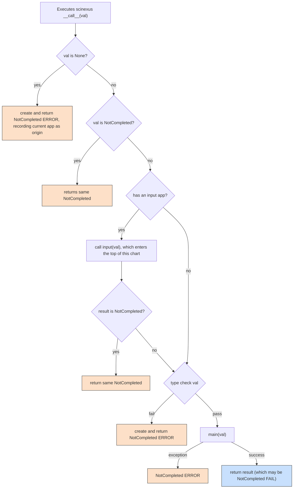

# Execution flow of a composed app

!!! abstract ""

    How data flows through a composed pipeline, step by step.

Consider two apps composed into a pipeline:

```python { notest }
from scinexus import define_app


@define_app(app_type="loader")
def read_json(path: str) -> dict:
    import json

    with open(path) as f:
        return json.load(f)


@define_app
def validate(data: dict, required_field: str) -> dict:
    if required_field not in data:
        raise ValueError(f"missing {required_field!r} field")
    return data


app = read_json() + validate(required_field="name")
```

Composing with `+` creates a new app where `validate` is the outermost app and `read_json` is stored as its `.input` attribute. When you call `app(filepath)`, execution begins at the outermost app and works inward.

## The execution flow when you call `app(filepath)`



This is the same sequence for every composed app, regardless of pipeline length. Each app in the chain runs the same `__call__` checks, so `NotCompleted` propagation and exception handling are consistent throughout. See [Runtime type checking](type-system.md#runtime-type-checking) for details on how type validation works and how to disable it.
